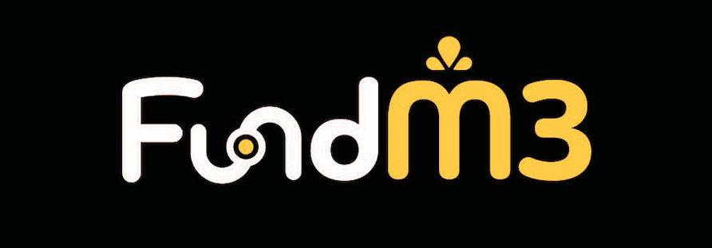

  

<!-- 

  
  

 -->
    
## Overview 👀
FundM3 is a donation platform designed to support independent creators and projects worldwide. It integrates Farcaster Frames, allowing creators to showcase their projects by casting the frame on SocialFi, thereby enhancing visibility and engagement.

## Techstack 🛠
1. **Frontend** - Next.js & Wagmi & Shadcn-ui & Next-auth & SIWE & Rainbowkit 
2. **Backend** - Nest.js & Postgres
3. **Smart Contract** - Solidity & Foundry
4. **Frames** - Frog & Neynar

## Contract Address 📄
Base Sepolia Testnet - 0xD12Ad3de4a549e0Eb32c81790501d6DFE186606D

## Problem 🧐
- **Lack of Transparency**: Traditional donation platforms often suffer from a lack of transparency, leaving donors uncertain about how their contributions are being utilized. This can erode trust and deter potential sponsors from supporting projects.
- **GitHub Sponsor Limitations**: Regional restrictions, such as the policy in Finland that prevents developers from accepting donations, present significant barriers. These limitations prevent developers from receiving financial support, hindering their ability to sustain and grow their projects.
- **Complex Financial Processes**: Traditional financial systems can be cumbersome, with lengthy procedures that delay the flow of funds. This inefficiency can be a major obstacle for developers who need timely access to resources to continue their work.
- **Promotion Challenges for Builders**: Many developers, especially indie hackers, struggle with self-promotion. They often lack the tools or knowledge to effectively showcase their projects, which can limit their reach and impact.
- **Fragmented User Experience**: Existing platforms often require users to navigate through multiple webpages, adding unnecessary steps to the donation process. This fragmented experience can discourage potential donors and reduce overall engagement.

## Solution 😄
- **Enhanced Transparency through Blockchain**: FundM3 leverages blockchain technology to ensure complete transparency in the donation process. Every transaction is recorded on the blockchain, providing a clear and immutable record of how funds are distributed and used. This builds trust with donors and encourages ongoing support.
- **“Anytime, Anywhere, Anyone” Approach**: FundM3 is designed to be accessible to everyone, regardless of their location or background. The platform's decentralized nature allows developers and donors to connect and interact without geographical restrictions, making it possible for "Anyone" to contribute from "Anywhere" at "Anytime."
- **Integrated Project Promotion**: By integrating Farcaster Frames, FundM3 allows developers to share their portfolios and projects seamlessly within the platform. This feature empowers developers to promote their work more effectively, reaching a wider audience without needing separate personal websites or extensive marketing knowledge.
- **Streamlined Donation Process**: FundM3 eliminates the need to navigate multiple webpages to make a donation. With the platform's seamless integration of Farcaster Frames and social media, users can donate directly through the same interface where they view and interact with project content. This convenience encourages more donations by reducing friction in the process.

## How it works? 🚢

## Our key features 🔐
- **Convenience**: Allows users to donate directly on creator or project pages, or via Warpcast frame.
- **Transparency**: The donor list displays information about donors, and transaction queries are publicly transparent.
- **Diversity**: Offers multiple ways to showcase and support projects, including exploring the marketplace and connecting via SocialFi.
- **Community Feel**: The integration of SocialFi fosters a stronger sense of community, enabling more interaction and communication between donors and creators.
